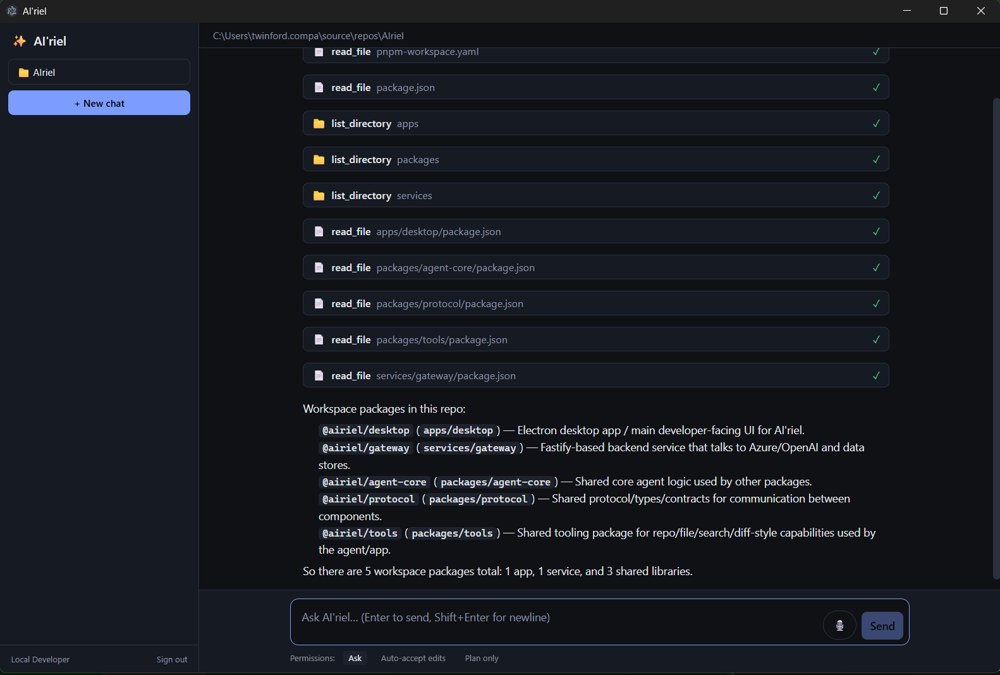

# AI'riel

In-house AI coding assistant for company developers, powered by **Azure AI Foundry**.
A desktop app (Electron) that opens a working directory, reads and searches the code, proposes
edits with diff review, runs builds and tests with approval, and takes voice input. Company SSO
via Entra ID; per-user usage tracked through a gateway in Azure.

```
apps/desktop        Electron + React desktop app (main: MSAL sign-in, agent host; renderer: chat UI)
packages/agent-core Agent loop, permissions, compaction, gateway model provider (pure TS, tested)
packages/tools      Workspace-confined tools: list/read/glob/grep, edit/write with diffs, run_command, git
packages/protocol   Zod schemas shared by desktop and gateway (messages, SSE events, IPC names)
services/gateway    Fastify API: Entra JWT → Azure AI Foundry streaming, usage logging, speech tokens
infra/              Bicep (Foundry, Container Apps, SQL, Speech, App Insights) + Entra app script
docs/               Project plan, ADRs, onboarding
```



## Quick start (local)

```powershell
pnpm install
pnpm build
pnpm test

# One-time: gateway settings (Foundry endpoint, key, deployment names). Never commit .env.
copy servicesgateway.env.example servicesgateway.env   # then edit it

# Start gateway (dev auth, in-memory usage) and the desktop app together
pnpm dev

# Or separately: pnpm dev:gateway / pnpm dev:desktop.
# With no Entra client id configured the desktop runs as a local dev user against http://localhost:8080.
# AIRIEL_WORKSPACE=<path> preselects the folder to open; otherwise the last folder is remembered.
# Voice: hold the mic button (or Ctrl+Shift+Space) and speak; release to stop. Uses the Foundry resource's Speech service.
```

See `docs/ONBOARDING.md` for Azure setup (Foundry, Entra, Speech) and `docs/PROJECT-PLAN.md` for the roadmap.
